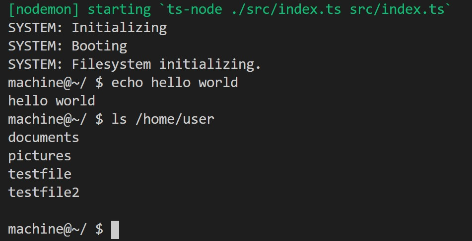

# simTerm
A TypeScript based, Linux-like operating system and terminal simulator.

simTerm is a self-learning project and likely has no real-world applications. You can run it, and interact with it similar to a Linux-based operating system. simTerm has a simulated file system with permissions, and replications of popular linux commands.

